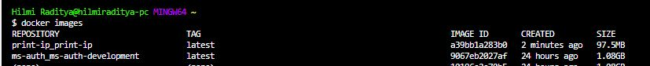
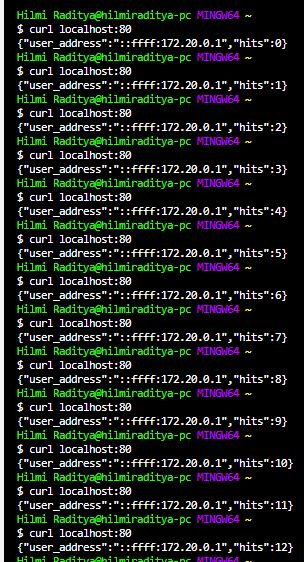

# Print IP

## Docker Images

The docker images size < 100mb

## Result

The response contains the client ip and the counts of request

## Run Container Via Docker-Compose 

    docker-compose up -d
    docker-compose down 

## Run Container Via Docker CLI 

    docker run -d -p 80:3000 --name <container_name> <images_name>:<tag>
